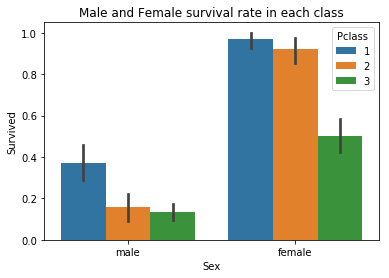

<h3> Important note - The following is not a display of the full project! This is an issue with Markdown files reading html tags. Please refer to `Project_Titanic_Data.html` file to see the full project. Consider this a glimpse of the project on the front-end.</h3>

<h1>Investigating Titanic Data</h1><br>

Author: Tanbir<br>
Completion Date: October 2017<br>
<br>
Version: 1.1 <br>
Future Updates: N/A until current Dataset is updated then more research and updates will be done <br>
Feature: Pandas Dataframe to solve questions of the data <br>
Data obtained from: https://www.kaggle.com/c/titanic/data</p>

<h1>Introduction </h1><br>
The sinking of the RMS Titanic is one of the most infamous shipwrecks in history.  On April 15, 1912, during her maiden voyage, the Titanic sank after colliding with an iceberg, killing 1502 out of 2224 passengers and crew. This sensational tragedy shocked the international community and led to better safety regulations for ships.<br>
<br>
One of the reasons that the shipwreck led to such loss of life was that there were not enough lifeboats for the passengers and crew. Although there was some element of luck involved in surviving the sinking, some groups of people were more likely to survive than others, such as women, children, and the upper-class.<br>
<br>
In this challenge, I will tackle two questions to solve:<br>
<p>1) What factors made people more likely to survive?
<p>
2) What factors determined the pricing of the fare based on the data?

<p><b>Please note that the finding/conclusions here are tentative<b> 
</p></p></p>


```python
#We will first import any library that are utilized so
#we will not have to call them again

import pandas as pd
import numpy as np
import random as rnd

import seaborn as sns
import matplotlib.pyplot as plt
%matplotlib inline
%pylab inline
```

    Populating the interactive namespace from numpy and matplotlib
    

<b>Data Wrangling & Exploratory</b>

Using pandas' dataframe to analyse the data and clean any issues along the way to answer the first question. First lets use pandas' csv reader function to grab our data and print the first few data to see if it's successful.


```python
passenger_df = pd.read_csv('titanic-data.csv')

passenger_df.head()
```


<div>
<style>
    .dataframe thead tr:only-child th {
        text-align: right;
    }

    .dataframe thead th {
        text-align: left;
    }

    .dataframe tbody tr th {
        vertical-align: top;
    }
</style>
<table border="1" class="dataframe">
  <thead>
    <tr style="text-align: right;">
      <th></th>
      <th>PassengerId</th>
      <th>Survived</th>
      <th>Pclass</th>
      <th>Name</th>
      <th>Sex</th>
      <th>Age</th>
      <th>SibSp</th>
      <th>Parch</th>
      <th>Ticket</th>
      <th>Fare</th>
      <th>Cabin</th>
      <th>Embarked</th>
    </tr>
  </thead>
  <tbody>
    <tr>
      <th>0</th>
      <td>1</td>
      <td>0</td>
      <td>3</td>
      <td>Braund, Mr. Owen Harris</td>
      <td>male</td>
      <td>22.0</td>
      <td>1</td>
      <td>0</td>
      <td>A/5 21171</td>
      <td>7.2500</td>
      <td>NaN</td>
      <td>S</td>
    </tr>
    <tr>
      <th>1</th>
      <td>2</td>
      <td>1</td>
      <td>1</td>
      <td>Cumings, Mrs. John Bradley (Florence Briggs Th...</td>
      <td>female</td>
      <td>38.0</td>
      <td>1</td>
      <td>0</td>
      <td>PC 17599</td>
      <td>71.2833</td>
      <td>C85</td>
      <td>C</td>
    </tr>
    <tr>
      <th>2</th>
      <td>3</td>
      <td>1</td>
      <td>3</td>
      <td>Heikkinen, Miss. Laina</td>
      <td>female</td>
      <td>26.0</td>
      <td>0</td>
      <td>0</td>
      <td>STON/O2. 3101282</td>
      <td>7.9250</td>
      <td>NaN</td>
      <td>S</td>
    </tr>
    <tr>
      <th>3</th>
      <td>4</td>
      <td>1</td>
      <td>1</td>
      <td>Futrelle, Mrs. Jacques Heath (Lily May Peel)</td>
      <td>female</td>
      <td>35.0</td>
      <td>1</td>
      <td>0</td>
      <td>113803</td>
      <td>53.1000</td>
      <td>C123</td>
      <td>S</td>
    </tr>
    <tr>
      <th>4</th>
      <td>5</td>
      <td>0</td>
      <td>3</td>
      <td>Allen, Mr. William Henry</td>
      <td>male</td>
      <td>35.0</td>
      <td>0</td>
      <td>0</td>
      <td>373450</td>
      <td>8.0500</td>
      <td>NaN</td>
      <td>S</td>
    </tr>
  </tbody>
</table>
</div>


Success. So lets start off by counting the total values in each column to make sure most variables matches up.


```python
passenger_df.count()
```


    PassengerId    891
    Survived       891
    Pclass         891
    Name           891
    Sex            891
    Age            714
    SibSp          891
    Parch          891
    Ticket         891
    Fare           891
    Cabin          204
    Embarked       889
    dtype: int64


According to the documentation of variables in the website, we know that not all ages are known so they left those field blank. There are some which are decimals (estimated) and others less than 1. So the total numbers not matching up with the amount of rows is okay. Also, not all passengers stayed in a Cabin, so that's fine too. One variable here: Embarked seems to stand out from the rest because we have 889 who Embarked from the stations but it's recorded that 891 people were in the ship. The documentation doesn't state any reason about Embarked being empty as well. Now how did those two people end up in the ship? We will get back to this but first lets tackle our first question on the survivors with the following two codes.


```python
#Making sure if survive value is correct from the head based on the documentation
passenger_df['Survived'].head()
```


    0    0
    1    1
    2    1
    3    1
    4    0
    Name: Survived, dtype: int64


```python
#Counts the number of people that have survived
#and died in the dataframe

passenger_df['Survived'].value_counts()
```


    0    549
    1    342
    Name: Survived, dtype: int64


From this we can see that about 342 survived out of 549,
which is about 38%. Also the numbers add up to total of 891 but we know that only 889 embarked from the station. Now lets try validate that survival rate through describe() function and in addition see standard deviation and other statiscal value for the current data.


```python
#Helps gives us statiscal value of the passengers but remember there are two who didn't have a embark point.
passenger_df.describe()
```


<div>
<style>
    .dataframe thead tr:only-child th {
        text-align: right;
    }

    .dataframe thead th {
        text-align: left;
    }

    .dataframe tbody tr th {
        vertical-align: top;
    }
</style>
<table border="1" class="dataframe">
  <thead>
    <tr style="text-align: right;">
      <th></th>
      <th>PassengerId</th>
      <th>Survived</th>
      <th>Pclass</th>
      <th>Age</th>
      <th>SibSp</th>
      <th>Parch</th>
      <th>Fare</th>
    </tr>
  </thead>
  <tbody>
    <tr>
      <th>count</th>
      <td>891.000000</td>
      <td>891.000000</td>
      <td>891.000000</td>
      <td>714.000000</td>
      <td>891.000000</td>
      <td>891.000000</td>
      <td>891.000000</td>
    </tr>
    <tr>
      <th>mean</th>
      <td>446.000000</td>
      <td>0.383838</td>
      <td>2.308642</td>
      <td>29.699118</td>
      <td>0.523008</td>
      <td>0.381594</td>
      <td>32.204208</td>
    </tr>
    <tr>
      <th>std</th>
      <td>257.353842</td>
      <td>0.486592</td>
      <td>0.836071</td>
      <td>14.526497</td>
      <td>1.102743</td>
      <td>0.806057</td>
      <td>49.693429</td>
    </tr>
    <tr>
      <th>min</th>
      <td>1.000000</td>
      <td>0.000000</td>
      <td>1.000000</td>
      <td>0.420000</td>
      <td>0.000000</td>
      <td>0.000000</td>
      <td>0.000000</td>
    </tr>
    <tr>
      <th>25%</th>
      <td>223.500000</td>
      <td>0.000000</td>
      <td>2.000000</td>
      <td>20.125000</td>
      <td>0.000000</td>
      <td>0.000000</td>
      <td>7.910400</td>
    </tr>
    <tr>
      <th>50%</th>
      <td>446.000000</td>
      <td>0.000000</td>
      <td>3.000000</td>
      <td>28.000000</td>
      <td>0.000000</td>
      <td>0.000000</td>
      <td>14.454200</td>
    </tr>
    <tr>
      <th>75%</th>
      <td>668.500000</td>
      <td>1.000000</td>
      <td>3.000000</td>
      <td>38.000000</td>
      <td>1.000000</td>
      <td>0.000000</td>
      <td>31.000000</td>
    </tr>
    <tr>
      <th>max</th>
      <td>891.000000</td>
      <td>1.000000</td>
      <td>3.000000</td>
      <td>80.000000</td>
      <td>8.000000</td>
      <td>6.000000</td>
      <td>512.329200</td>
    </tr>
  </tbody>
</table>
</div>


The percentage is correct but what it exludeds here is the gender of the passenger who survived. Out of the 38% percent which gender survived the highest is the sub question to tackle next. Now lets see which had the higher percent of survival between the two. By using groupby() function.


```python
#Grouping Sex and Survival variable to find out the mean of which two gendered survived
passenger_df[["Sex", "Survived"]].\
groupby(['Sex'], as_index=False).mean()\
.sort_values(by='Survived')
```


<div>
<style>
    .dataframe thead tr:only-child th {
        text-align: right;
    }

    .dataframe thead th {
        text-align: left;
    }

    .dataframe tbody tr th {
        vertical-align: top;
    }
</style>
<table border="1" class="dataframe">
  <thead>
    <tr style="text-align: right;">
      <th></th>
      <th>Sex</th>
      <th>Survived</th>
    </tr>
  </thead>
  <tbody>
    <tr>
      <th>1</th>
      <td>male</td>
      <td>0.188908</td>
    </tr>
    <tr>
      <th>0</th>
      <td>female</td>
      <td>0.742038</td>
    </tr>
  </tbody>
</table>
</div>


We can see that female survived at a higher percent rate than the
males. But gender shouldn't be the only factor here. Let's look in to the Ticket class(Pclass) and Embarked station(Embarked) variable.


```python
passenger_df[['Pclass', 'Survived']].\
groupby(['Pclass'], as_index=False).mean()\
.sort_values(by='Survived', ascending=False)
```


<div>
<style>
    .dataframe thead tr:only-child th {
        text-align: right;
    }

    .dataframe thead th {
        text-align: left;
    }

    .dataframe tbody tr th {
        vertical-align: top;
    }
</style>
<table border="1" class="dataframe">
  <thead>
    <tr style="text-align: right;">
      <th></th>
      <th>Pclass</th>
      <th>Survived</th>
    </tr>
  </thead>
  <tbody>
    <tr>
      <th>0</th>
      <td>1</td>
      <td>0.629630</td>
    </tr>
    <tr>
      <th>1</th>
      <td>2</td>
      <td>0.472826</td>
    </tr>
    <tr>
      <th>2</th>
      <td>3</td>
      <td>0.242363</td>
    </tr>
  </tbody>
</table>
</div>


This shows that people who purchased the first class were more likely to survived than second and third class.


```python
passenger_df[['Embarked', 'Survived']].\
groupby(['Embarked'], as_index=False).mean().\
sort_values(by='Survived', ascending=False)
```


<div>
<style>
    .dataframe thead tr:only-child th {
        text-align: right;
    }

    .dataframe thead th {
        text-align: left;
    }

    .dataframe tbody tr th {
        vertical-align: top;
    }
</style>
<table border="1" class="dataframe">
  <thead>
    <tr style="text-align: right;">
      <th></th>
      <th>Embarked</th>
      <th>Survived</th>
    </tr>
  </thead>
  <tbody>
    <tr>
      <th>0</th>
      <td>C</td>
      <td>0.553571</td>
    </tr>
    <tr>
      <th>1</th>
      <td>Q</td>
      <td>0.389610</td>
    </tr>
    <tr>
      <th>2</th>
      <td>S</td>
      <td>0.336957</td>
    </tr>
  </tbody>
</table>
</div>


We can see people who embarked at Cherboug(C) had a higher percent rate of survival. The problem with this is that their can be outliers based on the population that embarked in those places and the two people that didn't embark, so let's check the number of people who entered each station.


```python
passenger_df['Embarked'].value_counts()
```


    S    644
    C    168
    Q     77
    Name: Embarked, dtype: int64


Southampton had the lowest survival average but had a dramatic high passengers that embarked which is significant because it can signify that there was a form of overcrowding in that embark station. We now know that embark station had a factor.

Following it up with the number male to female ratio that were present who embarked


```python
passenger_df['Sex'].value_counts()
```


    male      577
    female    314
    Name: Sex, dtype: int64


```python
passenger_df[["Sex", "Survived", "Embarked"]].\
groupby(['Sex'], as_index=False).count()\
.sort_values(by='Survived')
```


<div>
<style>
    .dataframe thead tr:only-child th {
        text-align: right;
    }

    .dataframe thead th {
        text-align: left;
    }

    .dataframe tbody tr th {
        vertical-align: top;
    }
</style>
<table border="1" class="dataframe">
  <thead>
    <tr style="text-align: right;">
      <th></th>
      <th>Sex</th>
      <th>Survived</th>
      <th>Embarked</th>
    </tr>
  </thead>
  <tbody>
    <tr>
      <th>0</th>
      <td>female</td>
      <td>314</td>
      <td>312</td>
    </tr>
    <tr>
      <th>1</th>
      <td>male</td>
      <td>577</td>
      <td>577</td>
    </tr>
  </tbody>
</table>
</div>


From the following result we still see the problem. There were two people that did not embarked from a station. We can assume that these two people most likely did not enter the ship to begin with and had definitely survived. To verify this we have to check if those two survived and will be removed in a new data frame.


```python
#This code will check the dataframe and see if any value is null in
#the Embarked column

passenger_df[passenger_df['Embarked'].isnull()]
```


<div>
<style>
    .dataframe thead tr:only-child th {
        text-align: right;
    }

    .dataframe thead th {
        text-align: left;
    }

    .dataframe tbody tr th {
        vertical-align: top;
    }
</style>
<table border="1" class="dataframe">
  <thead>
    <tr style="text-align: right;">
      <th></th>
      <th>PassengerId</th>
      <th>Survived</th>
      <th>Pclass</th>
      <th>Name</th>
      <th>Sex</th>
      <th>Age</th>
      <th>SibSp</th>
      <th>Parch</th>
      <th>Ticket</th>
      <th>Fare</th>
      <th>Cabin</th>
      <th>Embarked</th>
    </tr>
  </thead>
  <tbody>
    <tr>
      <th>61</th>
      <td>62</td>
      <td>1</td>
      <td>1</td>
      <td>Icard, Miss. Amelie</td>
      <td>female</td>
      <td>38.0</td>
      <td>0</td>
      <td>0</td>
      <td>113572</td>
      <td>80.0</td>
      <td>B28</td>
      <td>NaN</td>
    </tr>
    <tr>
      <th>829</th>
      <td>830</td>
      <td>1</td>
      <td>1</td>
      <td>Stone, Mrs. George Nelson (Martha Evelyn)</td>
      <td>female</td>
      <td>62.0</td>
      <td>0</td>
      <td>0</td>
      <td>113572</td>
      <td>80.0</td>
      <td>B28</td>
      <td>NaN</td>
    </tr>
  </tbody>
</table>
</div>


Here we can see that both of these passenger, have the same ticket numbers and have paid the fare cost. But we don't know where they embarked from. We can now either assume three things here:
<p>1) They didn't embark the ship at all or</p>
<p>2) There is another embark point that wasn't recorded in the data where they had embarked from</p>
<p>3) The person who recorded it forgot to put the Embarked location</p>

However both of these people survived without no data on where they embarked while they both paid the fare. For our data to be solidified we're going to have to remove them using built in vectorize function and create a new Dataframe to plot and conclude.


```python
#Copying the data to a new dataframe
embarked_passenger_df = passenger_df.copy()

#Getting rid of the empty Embarked rows from the new dataframe
embarked_passenger_df.dropna(subset=['Embarked'], inplace=True)

#Counting to make sure the empty values were deleted
embarked_passenger_df.count()
```


    PassengerId    889
    Survived       889
    Pclass         889
    Name           889
    Sex            889
    Age            712
    SibSp          889
    Parch          889
    Ticket         889
    Fare           889
    Cabin          202
    Embarked       889
    dtype: int64


Finally to see the difference in the statistical value for the updated data using describe() again.


```python
embarked_passenger_df.describe()
```


<div>
<style>
    .dataframe thead tr:only-child th {
        text-align: right;
    }

    .dataframe thead th {
        text-align: left;
    }

    .dataframe tbody tr th {
        vertical-align: top;
    }
</style>
<table border="1" class="dataframe">
  <thead>
    <tr style="text-align: right;">
      <th></th>
      <th>PassengerId</th>
      <th>Survived</th>
      <th>Pclass</th>
      <th>Age</th>
      <th>SibSp</th>
      <th>Parch</th>
      <th>Fare</th>
    </tr>
  </thead>
  <tbody>
    <tr>
      <th>count</th>
      <td>889.000000</td>
      <td>889.000000</td>
      <td>889.000000</td>
      <td>712.000000</td>
      <td>889.000000</td>
      <td>889.000000</td>
      <td>889.000000</td>
    </tr>
    <tr>
      <th>mean</th>
      <td>446.000000</td>
      <td>0.382452</td>
      <td>2.311586</td>
      <td>29.642093</td>
      <td>0.524184</td>
      <td>0.382452</td>
      <td>32.096681</td>
    </tr>
    <tr>
      <th>std</th>
      <td>256.998173</td>
      <td>0.486260</td>
      <td>0.834700</td>
      <td>14.492933</td>
      <td>1.103705</td>
      <td>0.806761</td>
      <td>49.697504</td>
    </tr>
    <tr>
      <th>min</th>
      <td>1.000000</td>
      <td>0.000000</td>
      <td>1.000000</td>
      <td>0.420000</td>
      <td>0.000000</td>
      <td>0.000000</td>
      <td>0.000000</td>
    </tr>
    <tr>
      <th>25%</th>
      <td>224.000000</td>
      <td>0.000000</td>
      <td>2.000000</td>
      <td>20.000000</td>
      <td>0.000000</td>
      <td>0.000000</td>
      <td>7.895800</td>
    </tr>
    <tr>
      <th>50%</th>
      <td>446.000000</td>
      <td>0.000000</td>
      <td>3.000000</td>
      <td>28.000000</td>
      <td>0.000000</td>
      <td>0.000000</td>
      <td>14.454200</td>
    </tr>
    <tr>
      <th>75%</th>
      <td>668.000000</td>
      <td>1.000000</td>
      <td>3.000000</td>
      <td>38.000000</td>
      <td>1.000000</td>
      <td>0.000000</td>
      <td>31.000000</td>
    </tr>
    <tr>
      <th>max</th>
      <td>891.000000</td>
      <td>1.000000</td>
      <td>3.000000</td>
      <td>80.000000</td>
      <td>8.000000</td>
      <td>6.000000</td>
      <td>512.329200</td>
    </tr>
  </tbody>
</table>
</div>


No major significant changes but the values are more accurate than before

<b> Visualization for the first question

The following visuals below tells us that female had a much better survival rate than male, in both Ticket class and all embarking points.


```python
sns.barplot(x='Sex', y='Survived', hue='Embarked', data=embarked_passenger_df).set_title("Male and Female survival rate in Embarked point");
```





```python
sns.barplot(x='Sex', y='Survived', hue='Pclass', data=embarked_passenger_df).set_title("Male and Female survival rate in each class");
```


Now lets check age factor to make our final conclusion based on what we have so far since we know females have a higher percentage.


```python
grid = sns.FacetGrid(embarked_passenger_df, col='Survived', row='Pclass')
grid.map(plt.hist, 'Age').set_titles("Survival Age rate in Pclass " "{row_name}")
grid.add_legend();
```


<b><h2>Conclusion for question 1 </h2><b>

Based on the data we can conclude that for survival factors - If you were a female you had  higher chance of surviving if you embarked from Cherbourg in first class at estimated age of 18 to 35. If you were a male, you had a significant chance of surviving if you embarked from Cherbourg in first class at estimated age of 18 to 35. The findings here are tentative.

<b><p> Exploratory Phase </b></p>
So lets examine the next question: What factors determined the pricing of the fare based on the data?
<p>We already know how many tickets are from the previous question. Now, lets start off by examinning the number of unique tickets.</p>


```python
#Code will count how many tickets are repeated and not repeated based on the value.
passenger_df['Ticket'].value_counts()
```


    CA. 2343             7
    347082               7
    1601                 7
    347088               6
    CA 2144              6
    3101295              6
    382652               5
    S.O.C. 14879         5
    PC 17757             4
    4133                 4
    LINE                 4
    349909               4
    347077               4
    W./C. 6608           4
    113760               4
    2666                 4
    113781               4
    19950                4
    17421                4
    347742               3
    239853               3
    110152               3
    24160                3
    13502                3
    PC 17572             3
    C.A. 34651           3
    248727               3
    35273                3
    F.C.C. 13529         3
    PC 17755             3
                        ..
    330877               1
    315094               1
    236852               1
    4137                 1
    4136                 1
    226593               1
    4134                 1
    374746               1
    110813               1
    C.A. 6212            1
    349219               1
    34218                1
    343120               1
    315086               1
    SC/AH 3085           1
    STON/O 2. 3101273    1
    345777               1
    STON/O 2. 3101274    1
    STON/O 2. 3101275    1
    113794               1
    2649                 1
    374887               1
    349213               1
    349210               1
    349242               1
    349216               1
    112052               1
    315088               1
    349215               1
    W./C. 14258          1
    Name: Ticket, Length: 681, dtype: int64


Lets examine the prices that were paid for the ticket.


```python
passenger_df['Fare'].value_counts()
```


    8.0500      43
    13.0000     42
    7.8958      38
    7.7500      34
    26.0000     31
    10.5000     24
    7.9250      18
    7.7750      16
    26.5500     15
    0.0000      15
    7.2292      15
    7.8542      13
    8.6625      13
    7.2500      13
    7.2250      12
    16.1000      9
    9.5000       9
    24.1500      8
    15.5000      8
    56.4958      7
    52.0000      7
    14.5000      7
    14.4542      7
    69.5500      7
    7.0500       7
    31.2750      7
    46.9000      6
    30.0000      6
    7.7958       6
    39.6875      6
                ..
    7.1417       1
    42.4000      1
    211.5000     1
    12.2750      1
    61.1750      1
    8.4333       1
    51.4792      1
    7.8875       1
    8.6833       1
    7.5208       1
    34.6542      1
    28.7125      1
    25.5875      1
    7.7292       1
    12.2875      1
    8.6542       1
    8.7125       1
    61.3792      1
    6.9500       1
    9.8417       1
    8.3000       1
    13.7917      1
    9.4750       1
    13.4167      1
    26.3875      1
    8.4583       1
    9.8375       1
    8.3625       1
    14.1083      1
    17.4000      1
    Name: Fare, Length: 248, dtype: int64


We can see that there are lots of repetitive tickets being used. So we can assume from here that the tickets with the same string may have the same price. So lets examine this.


```python
#Grouping Fare and ticket which will give us a more detail on the number of tickets and it's price by size()
passenger_df.groupby(['Fare', 'Ticket']).size()
```


    Fare      Ticket            
    0.0000    112050                1
              112052                1
              112058                1
              112059                1
              19972                 1
              239853                3
              239854                1
              239855                1
              239856                1
              LINE                  4
    4.0125    2648                  1
    5.0000    695                   1
    6.2375    345364                1
    6.4375    2683                  1
    6.4500    C 7075                1
    6.4958    3101264               1
              3101267               1
    6.7500    365222                1
              365226                1
    6.8583    394140                1
    6.9500    368323                1
    6.9750    347061                1
              347089                1
    7.0458    3460                  1
    7.0500    SOTON/O.Q. 3101305    1
              SOTON/O.Q. 3101306    1
              SOTON/O.Q. 3101307    1
              SOTON/O.Q. 3101310    1
              SOTON/O.Q. 3101311    1
              SOTON/O.Q. 3101312    1
                                   ..
    82.1708   PC 17604              2
    83.1583   11767                 2
              PC 17756              1
    83.4750   36973                 2
    86.5000   110152                3
    89.1042   17453                 2
    90.0000   19928                 2
              19943                 2
    91.0792   11967                 2
    93.5000   12749                 2
    106.4250  PC 17761              2
    108.9000  PC 17758              2
    110.8833  17421                 4
    113.2750  35273                 3
    120.0000  113760                4
    133.6500  PC 17611              2
    134.5000  16966                 2
    135.6333  PC 17760              3
    146.5208  PC 17569              2
    151.5500  113781                4
    153.4625  PC 17582              3
    164.8667  36928                 2
    211.3375  24160                 3
    211.5000  113503                1
    221.7792  PC 17483              1
    227.5250  PC 17757              4
    247.5208  PC 17558              2
    262.3750  PC 17608              2
    263.0000  19950                 4
    512.3292  PC 17755              3
    Length: 682, dtype: int64


The data here is pretty ambigous but there is one thing we can conclude from this. Anyone who had LINE ticket did not have to pay to enter and other tickets as well. This assumption leads to another problem. Since the price were the same for different tickets then that means there is bound to be tickets with different pricing for any reason. The only thing we can right now is compare some of the ticket purchased with other variable such as Spouse/Children, Cabin etc.<p>Lets look at the LINE ticket first then several other tickets</p>


```python
passenger_df.loc[passenger_df['Ticket'] == 'LINE']
```


<div>
<style>
    .dataframe thead tr:only-child th {
        text-align: right;
    }

    .dataframe thead th {
        text-align: left;
    }

    .dataframe tbody tr th {
        vertical-align: top;
    }
</style>
<table border="1" class="dataframe">
  <thead>
    <tr style="text-align: right;">
      <th></th>
      <th>PassengerId</th>
      <th>Survived</th>
      <th>Pclass</th>
      <th>Name</th>
      <th>Sex</th>
      <th>Age</th>
      <th>SibSp</th>
      <th>Parch</th>
      <th>Ticket</th>
      <th>Fare</th>
      <th>Cabin</th>
      <th>Embarked</th>
    </tr>
  </thead>
  <tbody>
    <tr>
      <th>179</th>
      <td>180</td>
      <td>0</td>
      <td>3</td>
      <td>Leonard, Mr. Lionel</td>
      <td>male</td>
      <td>36.0</td>
      <td>0</td>
      <td>0</td>
      <td>LINE</td>
      <td>0.0</td>
      <td>NaN</td>
      <td>S</td>
    </tr>
    <tr>
      <th>271</th>
      <td>272</td>
      <td>1</td>
      <td>3</td>
      <td>Tornquist, Mr. William Henry</td>
      <td>male</td>
      <td>25.0</td>
      <td>0</td>
      <td>0</td>
      <td>LINE</td>
      <td>0.0</td>
      <td>NaN</td>
      <td>S</td>
    </tr>
    <tr>
      <th>302</th>
      <td>303</td>
      <td>0</td>
      <td>3</td>
      <td>Johnson, Mr. William Cahoone Jr</td>
      <td>male</td>
      <td>19.0</td>
      <td>0</td>
      <td>0</td>
      <td>LINE</td>
      <td>0.0</td>
      <td>NaN</td>
      <td>S</td>
    </tr>
    <tr>
      <th>597</th>
      <td>598</td>
      <td>0</td>
      <td>3</td>
      <td>Johnson, Mr. Alfred</td>
      <td>male</td>
      <td>49.0</td>
      <td>0</td>
      <td>0</td>
      <td>LINE</td>
      <td>0.0</td>
      <td>NaN</td>
      <td>S</td>
    </tr>
  </tbody>
</table>
</div>


```python
passenger_df.loc[passenger_df['Ticket'] == 'PC 17755']
```


<div>
<style>
    .dataframe thead tr:only-child th {
        text-align: right;
    }

    .dataframe thead th {
        text-align: left;
    }

    .dataframe tbody tr th {
        vertical-align: top;
    }
</style>
<table border="1" class="dataframe">
  <thead>
    <tr style="text-align: right;">
      <th></th>
      <th>PassengerId</th>
      <th>Survived</th>
      <th>Pclass</th>
      <th>Name</th>
      <th>Sex</th>
      <th>Age</th>
      <th>SibSp</th>
      <th>Parch</th>
      <th>Ticket</th>
      <th>Fare</th>
      <th>Cabin</th>
      <th>Embarked</th>
    </tr>
  </thead>
  <tbody>
    <tr>
      <th>258</th>
      <td>259</td>
      <td>1</td>
      <td>1</td>
      <td>Ward, Miss. Anna</td>
      <td>female</td>
      <td>35.0</td>
      <td>0</td>
      <td>0</td>
      <td>PC 17755</td>
      <td>512.3292</td>
      <td>NaN</td>
      <td>C</td>
    </tr>
    <tr>
      <th>679</th>
      <td>680</td>
      <td>1</td>
      <td>1</td>
      <td>Cardeza, Mr. Thomas Drake Martinez</td>
      <td>male</td>
      <td>36.0</td>
      <td>0</td>
      <td>1</td>
      <td>PC 17755</td>
      <td>512.3292</td>
      <td>B51 B53 B55</td>
      <td>C</td>
    </tr>
    <tr>
      <th>737</th>
      <td>738</td>
      <td>1</td>
      <td>1</td>
      <td>Lesurer, Mr. Gustave J</td>
      <td>male</td>
      <td>35.0</td>
      <td>0</td>
      <td>0</td>
      <td>PC 17755</td>
      <td>512.3292</td>
      <td>B101</td>
      <td>C</td>
    </tr>
  </tbody>
</table>
</div>


We can finally determine one thing about the price here. The pricing is determined from the location the person Embarked from and the class they purchased for. Also sex, Parch, Cabin, Name, ID, and Age do not effect the pricing.   Recall earlier when we dealt with the two passengers who did not have a Embarked value, they both had same price point for the ticket and had same class. Lets check the tickets who's fare is 0 just to solidfy.


```python
passenger_df.loc[passenger_df['Fare'] == 0]
```


<div>
<style>
    .dataframe thead tr:only-child th {
        text-align: right;
    }

    .dataframe thead th {
        text-align: left;
    }

    .dataframe tbody tr th {
        vertical-align: top;
    }
</style>
<table border="1" class="dataframe">
  <thead>
    <tr style="text-align: right;">
      <th></th>
      <th>PassengerId</th>
      <th>Survived</th>
      <th>Pclass</th>
      <th>Name</th>
      <th>Sex</th>
      <th>Age</th>
      <th>SibSp</th>
      <th>Parch</th>
      <th>Ticket</th>
      <th>Fare</th>
      <th>Cabin</th>
      <th>Embarked</th>
    </tr>
  </thead>
  <tbody>
    <tr>
      <th>179</th>
      <td>180</td>
      <td>0</td>
      <td>3</td>
      <td>Leonard, Mr. Lionel</td>
      <td>male</td>
      <td>36.0</td>
      <td>0</td>
      <td>0</td>
      <td>LINE</td>
      <td>0.0</td>
      <td>NaN</td>
      <td>S</td>
    </tr>
    <tr>
      <th>263</th>
      <td>264</td>
      <td>0</td>
      <td>1</td>
      <td>Harrison, Mr. William</td>
      <td>male</td>
      <td>40.0</td>
      <td>0</td>
      <td>0</td>
      <td>112059</td>
      <td>0.0</td>
      <td>B94</td>
      <td>S</td>
    </tr>
    <tr>
      <th>271</th>
      <td>272</td>
      <td>1</td>
      <td>3</td>
      <td>Tornquist, Mr. William Henry</td>
      <td>male</td>
      <td>25.0</td>
      <td>0</td>
      <td>0</td>
      <td>LINE</td>
      <td>0.0</td>
      <td>NaN</td>
      <td>S</td>
    </tr>
    <tr>
      <th>277</th>
      <td>278</td>
      <td>0</td>
      <td>2</td>
      <td>Parkes, Mr. Francis "Frank"</td>
      <td>male</td>
      <td>NaN</td>
      <td>0</td>
      <td>0</td>
      <td>239853</td>
      <td>0.0</td>
      <td>NaN</td>
      <td>S</td>
    </tr>
    <tr>
      <th>302</th>
      <td>303</td>
      <td>0</td>
      <td>3</td>
      <td>Johnson, Mr. William Cahoone Jr</td>
      <td>male</td>
      <td>19.0</td>
      <td>0</td>
      <td>0</td>
      <td>LINE</td>
      <td>0.0</td>
      <td>NaN</td>
      <td>S</td>
    </tr>
    <tr>
      <th>413</th>
      <td>414</td>
      <td>0</td>
      <td>2</td>
      <td>Cunningham, Mr. Alfred Fleming</td>
      <td>male</td>
      <td>NaN</td>
      <td>0</td>
      <td>0</td>
      <td>239853</td>
      <td>0.0</td>
      <td>NaN</td>
      <td>S</td>
    </tr>
    <tr>
      <th>466</th>
      <td>467</td>
      <td>0</td>
      <td>2</td>
      <td>Campbell, Mr. William</td>
      <td>male</td>
      <td>NaN</td>
      <td>0</td>
      <td>0</td>
      <td>239853</td>
      <td>0.0</td>
      <td>NaN</td>
      <td>S</td>
    </tr>
    <tr>
      <th>481</th>
      <td>482</td>
      <td>0</td>
      <td>2</td>
      <td>Frost, Mr. Anthony Wood "Archie"</td>
      <td>male</td>
      <td>NaN</td>
      <td>0</td>
      <td>0</td>
      <td>239854</td>
      <td>0.0</td>
      <td>NaN</td>
      <td>S</td>
    </tr>
    <tr>
      <th>597</th>
      <td>598</td>
      <td>0</td>
      <td>3</td>
      <td>Johnson, Mr. Alfred</td>
      <td>male</td>
      <td>49.0</td>
      <td>0</td>
      <td>0</td>
      <td>LINE</td>
      <td>0.0</td>
      <td>NaN</td>
      <td>S</td>
    </tr>
    <tr>
      <th>633</th>
      <td>634</td>
      <td>0</td>
      <td>1</td>
      <td>Parr, Mr. William Henry Marsh</td>
      <td>male</td>
      <td>NaN</td>
      <td>0</td>
      <td>0</td>
      <td>112052</td>
      <td>0.0</td>
      <td>NaN</td>
      <td>S</td>
    </tr>
    <tr>
      <th>674</th>
      <td>675</td>
      <td>0</td>
      <td>2</td>
      <td>Watson, Mr. Ennis Hastings</td>
      <td>male</td>
      <td>NaN</td>
      <td>0</td>
      <td>0</td>
      <td>239856</td>
      <td>0.0</td>
      <td>NaN</td>
      <td>S</td>
    </tr>
    <tr>
      <th>732</th>
      <td>733</td>
      <td>0</td>
      <td>2</td>
      <td>Knight, Mr. Robert J</td>
      <td>male</td>
      <td>NaN</td>
      <td>0</td>
      <td>0</td>
      <td>239855</td>
      <td>0.0</td>
      <td>NaN</td>
      <td>S</td>
    </tr>
    <tr>
      <th>806</th>
      <td>807</td>
      <td>0</td>
      <td>1</td>
      <td>Andrews, Mr. Thomas Jr</td>
      <td>male</td>
      <td>39.0</td>
      <td>0</td>
      <td>0</td>
      <td>112050</td>
      <td>0.0</td>
      <td>A36</td>
      <td>S</td>
    </tr>
    <tr>
      <th>815</th>
      <td>816</td>
      <td>0</td>
      <td>1</td>
      <td>Fry, Mr. Richard</td>
      <td>male</td>
      <td>NaN</td>
      <td>0</td>
      <td>0</td>
      <td>112058</td>
      <td>0.0</td>
      <td>B102</td>
      <td>S</td>
    </tr>
    <tr>
      <th>822</th>
      <td>823</td>
      <td>0</td>
      <td>1</td>
      <td>Reuchlin, Jonkheer. John George</td>
      <td>male</td>
      <td>38.0</td>
      <td>0</td>
      <td>0</td>
      <td>19972</td>
      <td>0.0</td>
      <td>NaN</td>
      <td>S</td>
    </tr>
  </tbody>
</table>
</div>


From this we can remove the fact that class determines the pricing and ticket number. We need to now finally check if Sibblings played a factor


```python
passenger_df.loc[passenger_df['Ticket'] == '19950']
```


<div>
<style>
    .dataframe thead tr:only-child th {
        text-align: right;
    }

    .dataframe thead th {
        text-align: left;
    }

    .dataframe tbody tr th {
        vertical-align: top;
    }
</style>
<table border="1" class="dataframe">
  <thead>
    <tr style="text-align: right;">
      <th></th>
      <th>PassengerId</th>
      <th>Survived</th>
      <th>Pclass</th>
      <th>Name</th>
      <th>Sex</th>
      <th>Age</th>
      <th>SibSp</th>
      <th>Parch</th>
      <th>Ticket</th>
      <th>Fare</th>
      <th>Cabin</th>
      <th>Embarked</th>
    </tr>
  </thead>
  <tbody>
    <tr>
      <th>27</th>
      <td>28</td>
      <td>0</td>
      <td>1</td>
      <td>Fortune, Mr. Charles Alexander</td>
      <td>male</td>
      <td>19.0</td>
      <td>3</td>
      <td>2</td>
      <td>19950</td>
      <td>263.0</td>
      <td>C23 C25 C27</td>
      <td>S</td>
    </tr>
    <tr>
      <th>88</th>
      <td>89</td>
      <td>1</td>
      <td>1</td>
      <td>Fortune, Miss. Mabel Helen</td>
      <td>female</td>
      <td>23.0</td>
      <td>3</td>
      <td>2</td>
      <td>19950</td>
      <td>263.0</td>
      <td>C23 C25 C27</td>
      <td>S</td>
    </tr>
    <tr>
      <th>341</th>
      <td>342</td>
      <td>1</td>
      <td>1</td>
      <td>Fortune, Miss. Alice Elizabeth</td>
      <td>female</td>
      <td>24.0</td>
      <td>3</td>
      <td>2</td>
      <td>19950</td>
      <td>263.0</td>
      <td>C23 C25 C27</td>
      <td>S</td>
    </tr>
    <tr>
      <th>438</th>
      <td>439</td>
      <td>0</td>
      <td>1</td>
      <td>Fortune, Mr. Mark</td>
      <td>male</td>
      <td>64.0</td>
      <td>1</td>
      <td>4</td>
      <td>19950</td>
      <td>263.0</td>
      <td>C23 C25 C27</td>
      <td>S</td>
    </tr>
  </tbody>
</table>
</div>


We can now safely say that Embarked point and ticket number determined the pricing.

<h1>Limitation</h1>

There were several limitation when it came to examining the data and trying to find well established conclusion. The first is the fact that not all age for the passengers were recorded. Over 100 values in age within the data are missing. If I had a solid number for every one of them, then I could have made an additional findings that will be conclusive on the age factor of people who survived. Also, removing the two missing data on embark was a challenge for me. However, the data was sufficient on finding the genders survival rate.
<br>
<br>
The final biggest limitation and hinderance, is the fact that there were no data provided in regards to how the fare price for each passenger was calculated. When you look at the data, the only thing you can tell is the pricing were set from the embarked point and ticket number. However, it's impossible to figure out exactly what the prices were because everyone had a different fare for almost every criteria. You will see people who had the same ticket also had the same pricing and embark point. However you'll notice that their age, sex, spouse/children, parents and class are different for every possible data. If we had values like the day they purchased the ticket, or discounts/promotion offers of the passenger in the data then we would have a higher chance of finding the actual fare price based on the factors presented. I wanted to find the exact pricing from the fare because it can also help determine how the economy was when it came to boarding ships.

<b><h1>Final Conclusion</h1></b>

Please note the conclusions tentative:
<br>
1. Based on the data we can conclude that for survival factors - If you were a female you had  higher chance of surviving if you embarked from Cherbourg in first class at estimated age of 18 to 35. If you were a male, you had a significant chance of surviving if you embarked from Cherbourg in first class at estimated age of 18 to 35.

2. The fare of the tickets were determined from where the person embarked from and the tickets number were exclusive to that Embarked point. In addition the ticket numbers determined the price fo fare because you see repeated number of ticket being used with the same price. This is the closest we can determine for the pricing of tickets. We are missing many information such as discounts, when the tickets were purchased etc. If we were to have additional more data from the past we can probably determine each price. Then again the findings here are tentative.<br>

<b>Sources:</b>
<br>https://www.udacity.com/
<br>https://stackoverflow.com
<br>https://www.kaggle.com/
<br>https://pandas.pydata.org/pandas-docs/stable/
<br>https://seaborn.pydata.org/generated/seaborn.FacetGrid.html

